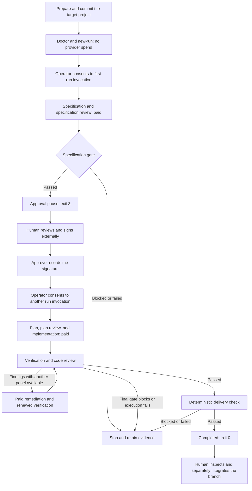

# Runbook: Set up a project and deliver a feature with BuildWorks

**Audience:** Developers, project owners, and operators using the local CLI.
**Applies to:** The implemented checkout-local CLI, using PowerShell on Windows.
**Maintainer:** BuildWorks maintainers; update this runbook when operator commands,
approval transport, or setup requirements change.

This runbook takes a separate Git project from initial setup to a retained,
reviewed delivery branch. BuildWorks sequences the stages and records their
evidence; the operator owns the requirements, spending consent, approval signature,
and release decision.

It does not install a distributed `bw` package, scaffold an application, publish
to GitHub, merge a branch, deploy, or repair an interrupted run. Claude Code is the
implemented harness; selecting a different model does not select another harness.
The commands below are operator instructions, not authorization for an agent to
spend money or sign on your behalf.

## Workflow and decision boundaries



One execution consent covers every group in that invocation's preview, including
bounded internal remediation, until approval or terminalization. It is not
single-stage consent, a hard dollar cap, signature authority, or consent to a
later invocation. There is no voluntary stop-after option.

## 1. Prepare the BuildWorks checkout

Use Node 24 or newer, npm, Git with a working commit identity, and the native
Claude Code executable on PATH. Arrange authorized Claude provider access and
model entitlement separately. No GitHub account or remote is needed to operate
an already available local checkout and target.

Obtain this repository through your normal Git workflow. Set the checkout path
to your own location, not another user's machine:

```powershell
$ErrorActionPreference = 'Stop'
$PSNativeCommandUseErrorActionPreference = $false
$BuildWorksCheckout = (Resolve-Path -LiteralPath (Read-Host 'Absolute path to the BuildWorks checkout')).Path
$BwCli = Join-Path $BuildWorksCheckout 'src\cli.ts'
$BwSigner = Join-Path $BuildWorksCheckout 'scripts\sign-approval.mjs'
Set-Location -LiteralPath $BuildWorksCheckout

node --version
if ($LASTEXITCODE -ne 0) { throw 'Node must be available.' }
git --version
if ($LASTEXITCODE -ne 0) { throw 'Git must be available.' }
claude --version
if ($LASTEXITCODE -ne 0) { throw 'The native Claude Code executable must be available.' }
```

Install BuildWorks' development dependencies once from that checkout:

```powershell
npm install
if ($LASTEXITCODE -ne 0) { throw 'BuildWorks dependency installation failed.' }
& node $BwCli --help
& node $BwCli help run
```

There is no build or npm-link step. `npm install` does not place this private
package's own `bw` executable on PATH. The complete checkout is needed because
runtime assets, including migrations, resolve beside the source.

Keep these variables in the same PowerShell session. The native-command setting
lets the examples handle exit codes explicitly, including the expected exit 3;
it has no native-command behavior on older PowerShell versions.

## 2. Prepare a separate target repository

Choose a durable local directory outside the BuildWorks checkout. Avoid temporary
directories that the operating system may remove at logoff. Do not relocate an
in-flight target: retained references can contain absolute paths.

```powershell
$Target = Read-Host 'Absolute path to the target project, not the BuildWorks checkout'
$Project = Read-Host 'Project identifier, for example calculator'
$FeatureId = Read-Host 'Feature identifier, for example calculator-1'
$Slug = Read-Host 'Lowercase kebab-case feature slug, for example web-calculator'
```

For an existing project, use its existing Git worktree. For a new project only,
create the directory and initialize Git:

```powershell
New-Item -ItemType Directory -Path $Target | Out-Null
git -C $Target init
if ($LASTEXITCODE -ne 0) { throw 'Target Git initialization failed.' }
```

Then, for either case:

```powershell
$Target = (Resolve-Path -LiteralPath $Target).Path
$FeatureDirectory = Join-Path $Target "docs\features\$Slug"
New-Item -ItemType Directory -Path $FeatureDirectory -Force | Out-Null
$DesignFile = Join-Path $FeatureDirectory 'design.md'
```

Author the following inputs in the target using your editor:

| Target input | Required preparation |
| --- | --- |
| `.gitignore` | Add `.governance/`, plus applicable dependency and build-output ignores. Do not ignore the design or verification configuration. |
| `governed.yaml` | Declare real project verification commands as described below. |
| `docs\features\<slug>\design.md` | State the desired behavior, users, requirements, constraints, exclusions, and acceptance expectations. The slug must match `$Slug`. |
| Application baseline | Supply any source, package manifest, lockfile, and verification scripts needed to make the intended project build and run. BuildWorks has no application initializer. |

The design should explicitly require any tests or documentation you expect in
the delivery. There is no separate implemented test-authoring or documentation
stage that will fill those gaps later. You do not hand-author generated `spec.md`
or `plan.md` for this workflow.

### Choose meaningful verification before intake

The following is an example for an npm project with a committed lockfile and
working `test` and `typecheck` scripts, not a universal configuration:

```yaml
verify:
  - name: dependencies
    command: ["npm", "ci"]
  - name: tests
    command: ["npm", "test"]
  - name: typecheck
    command: ["npm", "run", "typecheck"]
```

Use the project's actual commands. The parser accepts only a `verify:` block
with this indentation and key order, unique filename-safe names, and
double-quoted argv tokens. A token cannot contain spaces, quotes, backslashes,
or shell metacharacters; a target directory itself may contain spaces.

Verification runs in the newly created run worktree, not your original project
directory. Untracked dependencies are not copied there. Include appropriate
dependency setup when required, and make generated outputs ignored so commands
leave tracked files unchanged. Ensure the test command discovers real tests and
does not silently succeed with zero tests.

Commands run under bounded time/output limits and a restricted environment
passthrough. Arbitrary shell environment variables are not forwarded.
`VERIFY_ENV_PASSTHROUGH` in [the policy source](../../src/policy.ts) lists the
names. Values and accessible files are not frozen credentials. Verification is
not filesystem/network-sandboxed; dependency installation can execute package
scripts. Use only commands and repositories you are authorized to run, without
production credentials or data exposed to them.

Version-only commands such as `node --version` do not establish product
correctness. Do not use them as the project's only delivery evidence.

### Commit the starting state

Stage the intended baseline, design, configuration, and ignore rules explicitly
using your normal Git workflow. Review the staged changes before committing.
For example, after staging the intended files:

```powershell
git -C $Target --no-pager diff --cached --stat
git -C $Target commit -m "Prepare project for governed delivery"
if ($LASTEXITCODE -ne 0) { throw 'Commit the intended starting state before intake.' }
git -C $Target status --short
```

Do not commit secrets or unrelated work. Intake requires a readable HEAD and a
clean working tree. The verification configuration must be committed, not merely
present on disk.

## 3. Configure an external approval key

The operator uses a PEM Ed25519 key pair outside every repository. BuildWorks
receives only the public-key path. If another person signs, arrange their
public key before intake and transfer the payload/signature through your
organization's approved channel; never transfer their private key.

For the same-machine operator example:

```powershell
$OperatorDirectory = Join-Path $env:USERPROFILE '.buildworks'
$env:BW_APPROVAL_PUBLIC_KEY = Join-Path $OperatorDirectory 'approval.pub'
$OperatorKeyFile = Join-Path $OperatorDirectory 'approval.key'
```

Change the directory if your organization supplies another location. Ensure it
is outside every repository and access-controlled for the operator.

If you do not already have the appropriate pair, the operator may generate it
separately, while the current directory is still the BuildWorks checkout:

```powershell
& node $BwSigner keygen --out $OperatorDirectory
if ($LASTEXITCODE -ne 0) { throw 'Key generation failed; inspect the diagnostic.' }
```

Key generation creates the directory as needed and refuses to replace an
existing private key. Do not delete an existing key to bypass that refusal.
It also refuses an output directory inside a repository or under the invocation
directory.

**Set `BW_APPROVAL_PUBLIC_KEY` before creating a run.** The signer fingerprint
is frozen at intake. Adding or replacing a key later does not retroactively
strengthen or change that binding. Never put the private key in the target,
source control, prompts, logs, or an agent conversation.

## 4. Inspect readiness and create the run

```powershell
& node $BwCli doctor --repo $Target --slug $Slug
if ($LASTEXITCODE -ne 0) { throw 'Resolve the reported readiness failures before intake.' }
```

Doctor checks the local repository, committed inputs, current configuration,
public key, staffing, and a bounded native version probe without dispatching an
agent. It does not check provider authentication, model entitlement, quota, or
private-key availability. Review `NOT CHECKED` and limitation entries as well
as failures.

Select the model authorized for this work, then create the run:

```powershell
$Model = Read-Host 'Authorized Claude model name to freeze'
$RunIdText = & node $BwCli new-run --repo $Target `
    --project $Project --feature $FeatureId --slug $Slug `
    --change-kind feature --model $Model
if ($LASTEXITCODE -ne 0) { throw 'Run creation failed; retain the diagnostic and any named run ID.' }
$RunId = [long]$RunIdText

& node $BwCli status --repo $Target --run $RunId
if ($LASTEXITCODE -ne 0) { throw 'Cannot inspect the created run.' }
```

Use `defect_fix` instead of `feature` for defect work. Project, feature, slug,
change kind, and model are explicit inputs; `runs` never picks one for you.
Record the target path, checkout revision, and numeric run ID.

`new-run` initializes the local store as needed. A separate initial `migrate`
command is not required. Creation freezes the starting commit, model map,
agent definitions, policy/review limits, and verification commands; it does
not dispatch agents. A freeze failure may leave a blocked run whose ID is
printed in the diagnostic.

Always pass `--repo $Target`: omitting it selects the invocation worktree,
which in these examples is BuildWorks itself.

## 5. Consent to specification work

This step spends provider money after consent:

```powershell
& node $BwCli run --repo $Target --run $RunId
if ($LASTEXITCODE -ne 3) { throw 'Expected the approval pause; inspect the returned result before proceeding.' }
```

The CLI previews the frozen models, remaining groups, verification argv, review
budgets, and dispatch ceilings, then asks for `yes` in an interactive terminal.
Declining or ending the prompt starts no work. Once consented, it runs the
specification authoring/review group and, on success, returns control at
`awaiting_approval` with exit 3 and no held writer lock.

The stored run may still be `in_progress`; `awaiting_approval` is its derived
phase, not another persisted run status. A blocked specification is not an
approval pause.

Redirected stdin or `--json` requires `--yes`; use that flag only when you have
already authorized the full previewed range. Costs depend on the project,
model, output, and review/remediation work. There is no fixed price or enforced
dollar cap.

## 6. Review, sign, and submit approval

Inspect the paused run:

```powershell
& node $BwCli status --repo $Target --run $RunId
if ($LASTEXITCODE -ne 0) { throw 'Cannot inspect the approval boundary.' }
$SpecFile = Join-Path $FeatureDirectory 'spec.md'
```

Open `$SpecFile` in your editor. Compare the reviewed specification with the
design. Inspect its declared artifacts, risk, findings/decisions, and the
displayed specification hash, starting commit, profile hash, and signer
readiness. The signature authorizes that bound specification and scope.
It is not permission for agents to expand scope later.

If the specification is unacceptable, stop without signing and retain the
evidence. There is no general revise-and-resume or approval-revocation command.
Do not edit generated artifacts to try to force the existing run through.

### Export the canonical payload

Use the expiry supplied by the eligible action and keep it unchanged through
submission:

```powershell
$StatusJson = & node $BwCli status --repo $Target --run $RunId --json
if ($LASTEXITCODE -ne 0) { throw 'Cannot inspect approval actions.' }
$Snapshot = ($StatusJson | ConvertFrom-Json).result
$Request = $Snapshot.operatorActions | Where-Object kind -eq 'approval_request'
$Submit = $Snapshot.operatorActions | Where-Object kind -eq 'approval_submit'
if (-not $Request.eligible -or -not $Submit.eligible) {
    throw 'Approval actions are not ready; inspect signer and binding diagnostics.'
}
$ExpiresIndex = [array]::IndexOf($Request.args, '--expires')
if ($ExpiresIndex -lt 0) { throw 'The approval action has no expiry; inspect the action.' }
$Expires = $Request.args[$ExpiresIndex + 1]
$TransportId = [guid]::NewGuid().ToString('N')
$PayloadFile = Join-Path $OperatorDirectory "run-$RunId-$TransportId-payload.txt"
$SignatureFile = Join-Path $OperatorDirectory "run-$RunId-$TransportId-signature.txt"

& node $BwCli approval-request --repo $Target --run $RunId `
    --expires $Expires --out $PayloadFile
if ($LASTEXITCODE -ne 0) { throw 'Payload export failed; do not sign.' }
```

`--out` exclusively creates canonical UTF-8 bytes without BOM or trailing
newline. It does not create parent directories or overwrite files. Exporting
is not approval. The unique filenames avoid collisions between targets whose
run IDs both start at 1.

### Operator-only signing decision

Only after reviewing the bound work and exported payload, the human operator
runs:

```powershell
if (Test-Path -LiteralPath $SignatureFile) { throw 'Choose a new signature filename.' }
$OutputEncoding = [System.Text.UTF8Encoding]::new($false)
$Signature = Get-Content -LiteralPath $PayloadFile -Raw -Encoding utf8 |
    & node $BwSigner sign --key $OperatorKeyFile
if ($LASTEXITCODE -ne 0) { throw 'External signing failed; do not submit.' }
$Signature | Set-Content -LiteralPath $SignatureFile -Encoding utf8

& node $BwCli approve --repo $Target --run $RunId `
    --expires $Expires --signature-file $SignatureFile
if ($LASTEXITCODE -ne 0) { throw 'Approval was not recorded; do not continue.' }
```

The supplied signer normalizes PowerShell BOM/line-ending transport.
`--signature-file` accepts UTF-8 with an optional leading BOM and surrounding
whitespace. It does not accept an empty or malformed signature.

The default approval window is eight hours, with a current maximum of 24 hours.
If a payload expires before acceptance, inspect fresh eligible actions and
export/sign a new payload using new filenames. Do not submit an old signature
with a changed expiry. Expiry is checked at acceptance; it does not revoke an
already granted approval.

Approval does not execute later stages. The CLI never opens the private key
or invokes the signing tool.

## 7. Consent to implementation and delivery

This invocation needs new execution consent and can spend provider money:

```powershell
& node $BwCli run --repo $Target --run $RunId
if ($LASTEXITCODE -ne 0) { throw 'Delivery did not complete; inspect the result before any further action.' }
```

Review the new preview and enter `yes` to authorize plan/review, implementation,
verification, code review with bounded remediation, and delivery checking.
There is no separate human approval pause for the plan or code-review panel.

Implementation creates a branch named `gov/<slug>/<run-id>` and a retained
worktree under the target's `.governance\worktrees\<run-id>`. Patches are applied
and committed there, not to the default branch. Document projections may also
appear in the original target during earlier stages; do not assume that original
working copy will stay clean for the next intake.

The current code-review defaults are two reviewers, two complete panel
executions, and a final blocking threshold of `high`. Non-final findings are
sent together for remediation, followed by renewed verification and a complete
panel. The final panel applies the threshold without an unreviewed patch;
lower-severity findings can remain. Consult the frozen snapshot for this run
rather than assuming today's defaults were used.

## 8. Inspect the delivery, costs, and remaining findings

```powershell
& node $BwCli status --repo $Target --run $RunId
if ($LASTEXITCODE -ne 0) { throw 'Cannot inspect the final run.' }
$StatusJson = & node $BwCli status --repo $Target --run $RunId --json
if ($LASTEXITCODE -ne 0) { throw 'Cannot read the final snapshot.' }
$Snapshot = ($StatusJson | ConvertFrom-Json).result

$Snapshot.configuration.verificationCommands | Format-Table name, argv
$Snapshot.delivery | Format-List
$Snapshot.cost | Format-List
$Snapshot.cost.byStage | Format-Table kind, knownUsd, costReportedRows, costUnreportedRows
$Snapshot.evidence.references | Format-Table kind, availability, ref, reason
$Snapshot.evidence.findings | ConvertTo-Json -Depth 10
$Snapshot.limitations

& node $BwCli verify-audit --repo $Target
if ($LASTEXITCODE -ne 0) { throw 'Audit verification failed; retain evidence and escalate.' }
```

Confirm the phase is `completed`, delivery passed, the declared/delivered path
sets match with no missing paths, and the recorded reviewed/delivered commits
agree. Follow the retained verification logs and final code-review report.
Historical findings are not necessarily unresolved final findings:
`finalPanelBlocking` is null unless bound to the final panel, and false is
not a statement that a reported defect is fixed.

`knownUsd` is a recorded subtotal, not a complete provider bill or live cost
meter. Inspect reported/unreported coverage and recorded failed attempts before
interpreting it. Missing telemetry does not mean zero spend.

Use the recorded worktree and patch range for read-only inspection:

```powershell
$RunWorktree = $Snapshot.delivery.worktreePath
$PatchBase = $Snapshot.delivery.patchBase
$DeliveredCommit = $Snapshot.delivery.deliveredCommit
if (-not $RunWorktree -or -not $PatchBase -or -not $DeliveredCommit) {
    throw 'Delivery references are incomplete; inspect the snapshot.'
}
git --no-optional-locks -C $RunWorktree -c diff.autoRefreshIndex=false --no-pager diff --stat "$PatchBase..$DeliveredCommit"
if ($LASTEXITCODE -ne 0) { throw 'Cannot inspect the delivered patch range.' }
```

Open and exercise the product according to its own instructions before accepting
it for release. `completed` means the frozen gates passed and the declared
artifacts changed. It does not prove all product behavior, establish that a
test command ran meaningful tests, or erase below-threshold findings.

## 9. Integrate separately and preserve evidence

The retained branch is the local deliverable. Merging, pushing, creating a pull
request, and deploying are separate operator/release-owner decisions, using the
target project's normal workflow. No GitHub credentials, remote publication,
or automatic merge is part of `run`.

Before another feature, deliberately commit or set aside original-worktree
changes, including generated projections, without discarding unrelated work.
Author the next design, confirm verification configuration, and create a new
run with explicit identities and model. Do not reuse a completed run as a new
request; repeating `run` on it performs no new work. Changing frozen configuration
requires a new run, not a file edit inside the retained state.

Preserve the target's `.governance` state, logs, reports, and raw outputs while
they are needed. They are gitignored and are not backed up by a Git push.
Keep operator keys separately access-controlled. A durable local path is not
an independent backup, and copying or moving a target is not a supported
run-relocation procedure.

There is no general CLI rollback command. Before integration, you can withhold
release and keep the isolated branch/evidence. After integration, use the
project's established revert/release rollback process. Never hand-edit
`.governance`, reset another user's changes, or delete retained targets to
make an error disappear.

## Inspection and support reference

```powershell
& node $BwCli runs --repo $Target --limit 20
& node $BwCli status --repo $Target --run $RunId
& node $BwCli doctor --repo $Target --run $RunId
```

These three inspection commands spend nothing and do not create or migrate
state. `runs` reports `state_missing` with exit 1 before a store exists.
An existing empty store instead returns an empty inventory with exit 0.
Do not combine doctor's `--slug` and `--run` selectors.

`doctor`, `runs`, `status`, and `run` support `--json`. They emit one JSON object
to stdout, with progress/diagnostics on stderr. Do not merge stderr into a JSON
capture. For `status`, `.result` is the snapshot; for `run`, it contains
`.snapshot` and `.execution`. Legacy commands retain their numeric/path/raw
outputs. See the [README output contracts](../../README.md#output-contracts-and-refusal-handling)
for field definitions and the complete error-code list.

| Exit code | Meaning |
| --- | --- |
| `0` | Successful inspection/readiness; for `run`, completed delivery. A readable blocked-run `status` also exits 0. |
| `1` | Readiness failure, missing state/run, refusal, declined/missing consent, block, or execution failure. Read the reason. |
| `2` | Invalid command-line usage. |
| `3` | `run` reached the human approval pause. |

### Troubleshooting

| Symptom | Action |
| --- | --- |
| `bw` is not found | Use `& node $BwCli ...` with the complete checkout; npm does not install this package's own command. |
| Native Claude probe fails or reports `ENOENT` | Repair the native executable installation/PATH. Do not wrap Claude in PowerShell or `cmd.exe` to work around an assumed shim. |
| Doctor passes but a provider dispatch fails | Inspect the returned diagnostic and available retained output. Doctor does not establish authentication, model access, or quota. Preserve the failed run; renewed provider access does not make failed stages retryable. |
| No readable HEAD, dirty tree, or uncommitted config/design | Commit the intended target inputs and deliberately resolve working-copy changes before intake. Confirm the target and slug. |
| Invalid verification token or shape | Use the documented fixed YAML subset and argv constraints. Do not add shell command strings. Configuration changes require a fresh run. |
| Verification fails in the run worktree | Read the named command's retained output. Check actual test failures, fresh-worktree dependencies, environment requirements, and generated tracked changes. Do not weaken the gate or rerun a failed group blindly. |
| Public key missing/mismatched at approval | Restore the intended external public-key setup and compare its fingerprint with the frozen run. Do not replace the run's profile or private key to force acceptance. |
| Signing material refused inside a repository | Use an operator-controlled directory outside every repository; run key generation from the checkout with output elsewhere. Never move a private key into the target. |
| Payload/signature filename already exists | Use new transport filenames; never overwrite canonical approval bytes. |
| Approval expired or signature rejected | Read the binding diagnostic. Use one expiry across export/sign/submission; if expired before acceptance, start a fresh export/signing decision. Duplicate accepted approvals are refused, not execution commands. |
| `schema_unsupported` | Use the matching checkout for newer state. For an older schema, follow the diagnostic and explicitly authorize `& node $BwCli migrate --repo $Target`; inspection and guided consent do not migrate. |
| Writer contention or unreadable state | Do not launch a competing run or manually delete locks/journals. Inspect the reported writer/state evidence and coordinate with its owner; escalate crash-recovery cases. |
| `chain_incomplete`, missing/tampered evidence, moved/dirty run worktree | Retain everything and escalate. There is no general repair/resume switch, and manual stage commands are not a bypass. |
| `run_aged` | Guided execution refuses runs beyond the frozen deadline, currently seven days by default. Do not edit timestamps; inspect and arrange fresh work deliberately. |
| Final code review blocks | Inspect the final findings and frozen threshold. The remediation budget is exhausted; there is no waiver or automatic extra panel. Retain the reviewed commit and reports. |
| Execution was interrupted | Inspect status before any new invocation. Interrupting does not promise cleanup or resumability; only intact eligible stage-group boundaries can continue with fresh consent. |
| Evidence is missing on a completed run | Completion may remain inspectable while worktree evidence is unavailable. Do not interpret historical completion as proof of files that no longer exist. |

For escalation, collect the target/run identity, BuildWorks commit, Node/Git/Claude
versions, exact command and exit code, diagnostic text, snapshot limitations,
and referenced reports/logs. Give these to the BuildWorks maintainer and target
owner through approved channels. Raw outputs and snapshots may contain private
project information; redact as appropriate. Never attach approval private keys,
credentials, or unreviewed sensitive logs to a public issue.

## Maintainer references

The [architecture](../../ARCHITECTURE.md) is the design; this runbook documents
the implemented operator path, not a new runtime contract.

| Source | Governs |
| --- | --- |
| [CLI arguments](../../src/cli-args.ts) and [entry point](../../src/cli.ts) | Command syntax, routing, run creation, and approval file transport. |
| [Readiness](../../src/readiness.ts) and [run orchestration](../../src/run-command.ts) | No-spend checks, consent, stage-group boundaries, and refusal behavior. |
| [Configuration parser](../../src/governed-config.ts) and [policy](../../src/policy.ts) | Verification input shape, review controls, environment, and limits. |
| [External signer](../../scripts/sign-approval.mjs) | Operator-only key generation/signing and PowerShell transport normalization. |
| [Snapshot types](../../src/operator-state.ts) | Delivery, findings, cost coverage, and evidence fields. |
| [README operator reference](../../README.md#local-operator-guide) | Detailed existing command and output contracts. |

**Hazards considered:** [Hazards](../hazards.md) 2 (retain diagnostic evidence),
5 and 18 (delivery is not product correctness), 7 (no blind retry),
8 (native Claude launch versus verification shims), 11 and 12 (fresh-target
setup and visible frozen configuration), and 13 (human comparison of the
specification with the design).
